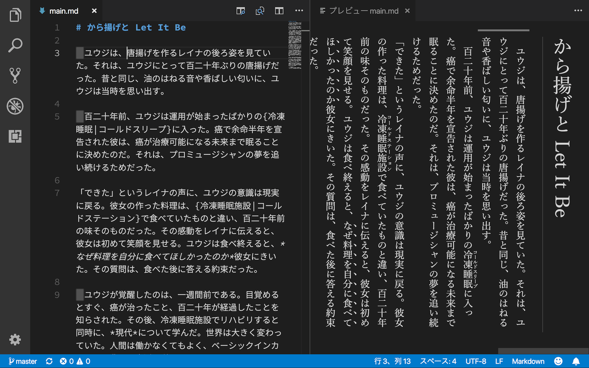

# markdown-preview-fuji-styles

This is the VS Code extension that changes built-in markdown preview to Fuji style, which matches Japanese novels.

## Features

- Vertical writing (縦書き)
- Emphasis using sesame dot (圏点を用いた強調)

## Known Issues

- Scroll sync (`markdown.preview.scrollPreviewWithEditor` and `markdown.preview.scrollEditorWithPreview`) does not work [#2](https://github.com/fuji-nakahara/vscode-markdown-preview-fuji-styles/issues/2)
- User settings `markdown.preview.fontFamily` and `markdown.preview.lineHeight` are ignored [#1](https://github.com/fuji-nakahara/vscode-markdown-preview-fuji-styles/issues/1)
